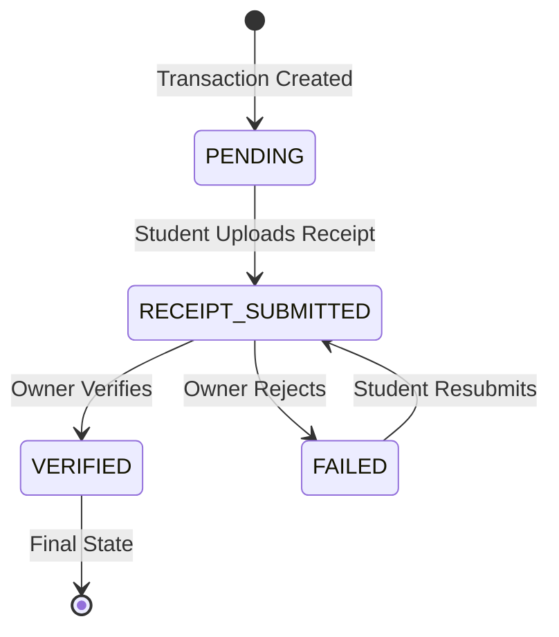

# Design Document: Payment System Integration

## Overview

This design document specifies the technical implementation of a comprehensive payment system for the hostel reservation platform. The system will transform the current booking flow from a simple reservation mechanism into a complete payment workflow with transaction tracking, receipt management, and verification capabilities.

### Current State

The existing system allows students to:
- Select a payment method (MTN Mobile Money, Airtel Money, Bank Transfer, Cash on Arrival)
- Create a booking with a note containing the payment method
- View a success page with instructions to contact the owner

The current implementation has significant gaps:
- No actual payment instructions (merchant codes, account numbers)
- No transaction tracking or payment status management
- No receipt upload or verification mechanism
- No payment history for students or owners
- Manual coordination required between students and owners

### Proposed Solution

The payment system integration will add:

1. **Payment Instructions**: Display specific merchant codes, account numbers, and payment guidance based on the selected payment method and hostel-specific configuration
2. **Transaction Management**: Create and track transaction records with unique references, amounts, methods, and status workflow
3. **Receipt Handling**: Allow students to upload payment receipts (images/PDFs) and owners to view and verify them
4. **Verification Workflow**: Enable owners to verify or reject receipts with reasons, automatically confirming bookings upon verification
5. **Transaction Dashboards**: Provide comprehensive transaction views for both students (payment history) and owners (transaction management with filtering)
6. **Payment Configuration**: Allow owners to configure their payment details per hostel
7. **Notification Integration**: Send notifications for all payment events (transaction created, receipt submitted, payment verified/rejected)

### Design Goals

- **Transparency**: Students always know what to pay, where to pay, and the status of their payment
- **Traceability**: Every payment has a unique reference and complete audit trail
- **Automation**: Bookings automatically confirm when payments are verified
- **Flexibility**: Support multiple payment methods with hostel-specific configuration
- **User Experience**: Intuitive interfaces for both students and owners
- **Data Integrity**: Enforce valid status transitions and amount calculations

## Architecture

### System Architecture

The payment system follows a three-tier architecture:

```
┌─────────────────────────────────────────────────────────────┐
│                     Presentation Layer                       │
│  ┌──────────────────────┐    ┌──────────────────────────┐  │
│  │  Student Interface   │    │   Owner Interface        │  │
│  │  - Payment Page      │    │   - Transaction Dashboard│  │
│  │  - Receipt Upload    │    │   - Receipt Verification │  │
│  │  - Transaction History│   │   - Payment Config       │  │
│  └──────────────────────┘    └──────────────────────────┘  │
└─────────────────────────────────────────────────────────────┘
                            │
                            ▼
┌─────────────────────────────────────────────────────────────┐
│                      Business Logic Layer                    │
│  ┌──────────────────────────────────────────────────────┐  │
│  │  Payment Service                                      │  │
│  │  - Transaction creation & validation                  │  │
│  │  - Status workflow management                         │  │
│  │  - Receipt processing                                 │  │
│  │  - Verification logic                                 │  │
│  │  - Booking confirmation integration                   │  │
│  └──────────────────────────────────────────────────────┘  │
│  ┌──────────────────────────────────────────────────────┐  │
│  │  Notification Service                                 │  │
│  │  - Payment event notifications                        │  │
│  └──────────────────────────────────────────────────────┘  │
└─────────────────────────────────────────────────────────────┘
                            │
                            ▼
┌─────────────────────────────────────────────────────────────┐
│                       Data Layer                             │
│  ┌──────────────────────────────────────────────────────┐  │
│  │  Prisma ORM + SQLite Database                         │  │
│  │  - Transaction records                                │  │
│  │  - Payment configuration                              │  │
│  │  - Receipt metadata                                   │  │
│  │  - Booking & room status updates                      │  │
│  └──────────────────────────────────────────────────────┘  │
│  ┌──────────────────────────────────────────────────────┐  │
│  │  File Storage                                         │  │
│  │  - Receipt files (images/PDFs)                        │  │
│  └──────────────────────────────────────────────────────┘  │
└─────────────────────────────────────────────────────────────┘
```

### Technology Stack

**Backend:**
- Node.js with Express.js for REST API
- Prisma ORM for database access
- SQLite for data persistence
- JWT for authentication
- Multer for file upload handling
- bcrypt for password hashing

**Frontend:**
- React 18 with Vite
- React Router for navigation
- TanStack Query (React Query) for server state management
- Axios for HTTP requests
- Tailwind CSS for styling
- Lucide React for icons

### Payment Status State Machine

The transaction status follows a strict state machine:



**Status Definitions:**
- `PENDING`: Transaction created, awaiting receipt submission
- `RECEIPT_SUBMITTED`: Student has uploaded payment proof, awaiting owner verification
- `VERIFIED`: Owner has confirmed payment received, booking automatically confirmed
- `FAILED`: Owner rejected receipt, student can resubmit

**Enforced Constraints:**
- Cannot transition from PENDING directly to VERIFIED or COMPLETED
- Cannot transition from VERIFIED to any other status (terminal state)
- Can transition from FAILED back to RECEIPT_SUBMITTED (resubmission)

## Components and Interfaces

### Backend Components

#### 1. Transaction Routes (`/backend/src/routes/transactions.js`)

**Endpoints:**

```javascript
POST   /api/transactions              // Create transaction (STUDENT)
GET    /api/transactions              // List transactions (filtered by role)
GET    /api/transactions/:id          // Get transaction details
POST   /api/transactions/:id/receipt  // Upload receipt (STUDENT)
PATCH  /api/transactions/:id/verify   // Verify receipt (OWNER)
PATCH  /api/transactions/:id/reject   // Reject receipt (OWNER)
```

**Authentication:** All endpoints require JWT authentication via `authenticate` middleware

**Authorization:**
- Students can only access their own transactions
- Owners can only access transactions for their hostels
- Admin can access all transactions

#### 2. Payment Configuration Routes (`/backend/src/routes/payment-config.js`)

**Endpoints:**

```javascript
GET    /api/hostels/:hostelId/payment-config     // Get payment config
PUT    /api/hostels/:hostelId/payment-config     // Update payment config (OWNER)
```

**Authorization:** Only the hostel owner can update payment configuration

#### 3. Transaction Service (`/backend/src/services/transactionService.js`)

**Responsibilities:**
- Transaction creation and validation
- Status transition enforcement
- Amount calculation and validation
- Receipt file handling
- Booking confirmation integration
- Notification triggering

**Key Methods:**

```javascript
createTransaction(bookingId, paymentMethod)
uploadReceipt(transactionId, file, studentId)
verifyReceipt(transactionId, ownerId)
rejectReceipt(transactionId, ownerId, reason)
getTransactionsByStudent(studentId, filters)
getTransactionsByOwner(ownerId, filters)
validateStatusTransition(currentStatus, newStatus)
calculateTransactionAmount(booking)
```

#### 4. File Upload Middleware (`/backend/src/middleware/upload.js`)

**Configuration:**
- Storage: Local filesystem in `/backend/uploads/receipts/`
- File types: JPEG, PNG, PDF
- Max file size: 5MB
- Filename: `{transactionId}_{timestamp}.{ext}`

**Validation:**
- File type validation
- File size validation
- Virus scanning (future enhancement)

### Frontend Components

#### 1. Enhanced Booking Page (`/frontend/src/pages/BookingPage.jsx`)

**Modifications:**
- Display payment instructions based on selected method and hostel config
- Show transaction reference after booking creation
- Link to transaction details page
- Display payment timeline

#### 2. Payment Instructions Component (`/frontend/src/components/PaymentInstructions.jsx`)

**Props:**
```javascript
{
  paymentMethod: string,
  paymentConfig: object,
  amount: number,
  transactionReference: string,
  hostelContact: object
}
```

**Displays:**
- Method-specific instructions (merchant codes, account details)
- Amount to pay
- Transaction reference
- Hostel contact information
- Next steps guidance

#### 3. Receipt Upload Component (`/frontend/src/components/ReceiptUpload.jsx`)

**Props:**
```javascript
{
  transactionId: string,
  onUploadSuccess: function,
  currentStatus: string
}
```

**Features:**
- Drag-and-drop file upload
- File type and size validation
- Upload progress indicator
- Preview uploaded receipt
- Resubmission for failed transactions

#### 4. Transaction Dashboard Page (`/frontend/src/pages/TransactionDashboard.jsx`)

**For Owners:**
- Table view of all transactions for owner's hostels
- Filters: status, payment method, date range, hostel
- Actions: view receipt, verify, reject
- Summary statistics (total pending, verified, failed)

**For Students:**
- List view of student's transactions
- Status badges with color coding
- Receipt upload button for pending transactions
- Transaction timeline view

#### 5. Receipt Viewer Component (`/frontend/src/components/ReceiptViewer.jsx`)

**Props:**
```javascript
{
  receiptUrl: string,
  receiptType: string,
  transactionId: string,
  canVerify: boolean,
  onVerify: function,
  onReject: function
}
```

**Features:**
- Image preview with zoom
- PDF viewer or download link
- Verification actions (for owners)
- Rejection reason input modal

#### 6. Payment Timeline Component (`/frontend/src/components/PaymentTimeline.jsx`)

**Props:**
```javascript
{
  transaction: object
}
```

**Displays:**
- Transaction created timestamp
- Receipt submitted timestamp (if applicable)
- Verification/rejection timestamp (if applicable)
- Current status with visual indicator
- Next action required

## Data Models

### Database Schema Changes

#### New Table: Transaction

```prisma
model Transaction {
  id                  String    @id @default(uuid())
  transactionRef      String    @unique
  bookingId           String    @unique
  booking             Booking   @relation(fields: [bookingId], references: [id])
  studentId           String
  student             User      @relation("StudentTransactions", fields: [studentId], references: [id])
  hostelId            String
  hostel              Hostel    @relation(fields: [hostelId], references: [id])
  amount              Int
  paymentMethod       String
  status              String    @default("PENDING")
  receiptUrl          String?
  receiptType         String?
  receiptSubmittedAt  DateTime?
  verifiedAt          DateTime?
  verifiedBy          String?
  verifier            User?     @relation("VerifiedTransactions", fields: [verifiedBy], references: [id])
  rejectionReason     String?
  rejectedAt          DateTime?
  createdAt           DateTime  @default(now())
  updatedAt           DateTime  @updatedAt
  
  receiptHistory      ReceiptHistory[]
}
```

**Field Descriptions:**
- `transactionRef`: Unique reference (format: `TXN-{timestamp}-{random}`)
- `amount`: Total amount in UGX (calculated from booking)
- `paymentMethod`: One of `MOBILE_MONEY_MTN`, `MOBILE_MONEY_AIRTEL`, `BANK_TRANSFER`, `CASH_ON_ARRIVAL`
- `status`: One of `PENDING`, `RECEIPT_SUBMITTED`, `VERIFIED`, `FAILED`
- `receiptUrl`: Path to uploaded receipt file
- `receiptType`: MIME type of receipt (image/jpeg, image/png, application/pdf)

#### New Table: ReceiptHistory

```prisma
model ReceiptHistory {
  id              String      @id @default(uuid())
  transactionId   String
  transaction     Transaction @relation(fields: [transactionId], references: [id])
  receiptUrl      String
  receiptType     String
  submittedAt     DateTime    @default(now())
  status          String      // SUBMITTED, VERIFIED, REJECTED
  rejectionReason String?
}
```

**Purpose:** Maintain audit trail of all receipt submissions and their outcomes

#### New Table: PaymentConfig

```prisma
model PaymentConfig {
  id                    String   @id @default(uuid())
  hostelId              String   @unique
  hostel                Hostel   @relation(fields: [hostelId], references: [id])
  mtnMobileMoneyNumber  String?
  airtelMoneyNumber     String?
  bankAccountName       String?
  bankAccountNumber     String?
  bankName              String?
  bankBranch            String?
  cashInstructions      String?
  createdAt             DateTime @default(now())
  updatedAt             DateTime @updatedAt
}
```

**Purpose:** Store hostel-specific payment details for generating instructions

#### Modified Table: Booking

```prisma
model Booking {
  // ... existing fields ...
  transaction  Transaction?
}
```

**Change:** Add one-to-one relation to Transaction

#### Modified Table: User

```prisma
model User {
  // ... existing fields ...
  transactionsAsStudent  Transaction[] @relation("StudentTransactions")
  transactionsVerified   Transaction[] @relation("VerifiedTransactions")
}
```

**Change:** Add relations for transaction tracking

#### Modified Table: Hostel

```prisma
model Hostel {
  // ... existing fields ...
  transactions    Transaction[]
  paymentConfig   PaymentConfig?
}
```

**Change:** Add relations for transactions and payment configuration

### API Request/Response Schemas

#### Create Transaction

**Request:**
```json
POST /api/transactions
{
  "bookingId": "uuid",
  "paymentMethod": "MOBILE_MONEY_MTN"
}
```

**Response:**
```json
{
  "transaction": {
    "id": "uuid",
    "transactionRef": "TXN-1234567890-ABC123",
    "amount": 800000,
    "paymentMethod": "MOBILE_MONEY_MTN",
    "status": "PENDING",
    "createdAt": "2024-01-15T10:30:00Z"
  },
  "paymentInstructions": {
    "method": "MTN Mobile Money",
    "merchantCode": "123456",
    "amount": 800000,
    "reference": "TXN-1234567890-ABC123"
  }
}
```

#### Upload Receipt

**Request:**
```
POST /api/transactions/:id/receipt
Content-Type: multipart/form-data

receipt: [file]
```

**Response:**
```json
{
  "message": "Receipt uploaded successfully",
  "transaction": {
    "id": "uuid",
    "status": "RECEIPT_SUBMITTED",
    "receiptUrl": "/uploads/receipts/uuid_1234567890.jpg",
    "receiptSubmittedAt": "2024-01-15T11:00:00Z"
  }
}
```

#### Verify Receipt

**Request:**
```json
PATCH /api/transactions/:id/verify
{
  "action": "verify"
}
```

**Response:**
```json
{
  "message": "Payment verified successfully",
  "transaction": {
    "id": "uuid",
    "status": "VERIFIED",
    "verifiedAt": "2024-01-15T12:00:00Z",
    "verifiedBy": "owner-uuid"
  },
  "booking": {
    "id": "booking-uuid",
    "status": "CONFIRMED",
    "confirmedAt": "2024-01-15T12:00:00Z"
  }
}
```

#### Reject Receipt

**Request:**
```json
PATCH /api/transactions/:id/reject
{
  "action": "reject",
  "reason": "Receipt is unclear, please resubmit a clearer image"
}
```

**Response:**
```json
{
  "message": "Receipt rejected",
  "transaction": {
    "id": "uuid",
    "status": "FAILED",
    "rejectionReason": "Receipt is unclear, please resubmit a clearer image",
    "rejectedAt": "2024-01-15T12:00:00Z"
  }
}
```

#### Get Payment Configuration

**Request:**
```
GET /api/hostels/:hostelId/payment-config
```

**Response:**
```json
{
  "paymentConfig": {
    "mtnMobileMoneyNumber": "0772123456",
    "airtelMoneyNumber": "0752123456",
    "bankAccountName": "John Doe Hostels",
    "bankAccountNumber": "1234567890",
    "bankName": "Stanbic Bank",
    "bankBranch": "Kampala Road",
    "cashInstructions": "Visit the hostel office during business hours (9 AM - 5 PM)"
  }
}
```

#### List Transactions (Owner)

**Request:**
```
GET /api/transactions?status=RECEIPT_SUBMITTED&paymentMethod=MOBILE_MONEY_MTN&startDate=2024-01-01&endDate=2024-01-31
```

**Response:**
```json
{
  "transactions": [
    {
      "id": "uuid",
      "transactionRef": "TXN-1234567890-ABC123",
      "amount": 800000,
      "paymentMethod": "MOBILE_MONEY_MTN",
      "status": "RECEIPT_SUBMITTED",
      "student": {
        "id": "student-uuid",
        "name": "Jane Student",
        "phone": "0771234567"
      },
      "hostel": {
        "id": "hostel-uuid",
        "name": "Comfort Hostel"
      },
      "room": {
        "id": "room-uuid",
        "roomType": "Single"
      },
      "receiptUrl": "/uploads/receipts/uuid_1234567890.jpg",
      "receiptSubmittedAt": "2024-01-15T11:00:00Z",
      "createdAt": "2024-01-15T10:30:00Z"
    }
  ],
  "pagination": {
    "total": 45,
    "page": 1,
    "pageSize": 20
  }
}
```

## Error Handling

### Error Categories

#### 1. Validation Errors (400 Bad Request)

**Scenarios:**
- Invalid payment method
- Transaction amount is zero or negative
- File type not supported
- File size exceeds limit
- Invalid status transition

**Response Format:**
```json
{
  "error": "Validation failed",
  "details": {
    "field": "paymentMethod",
    "message": "Payment method must be one of: MOBILE_MONEY_MTN, MOBILE_MONEY_AIRTEL, BANK_TRANSFER, CASH_ON_ARRIVAL"
  }
}
```

#### 2. Authorization Errors (403 Forbidden)

**Scenarios:**
- Student attempting to verify receipt
- Owner attempting to access another owner's transactions
- Student attempting to upload receipt for another student's transaction

**Response Format:**
```json
{
  "error": "Forbidden",
  "message": "You do not have permission to perform this action"
}
```

#### 3. Not Found Errors (404 Not Found)

**Scenarios:**
- Transaction ID does not exist
- Payment configuration not found
- Receipt file not found

**Response Format:**
```json
{
  "error": "Not found",
  "message": "Transaction not found"
}
```

#### 4. Conflict Errors (409 Conflict)

**Scenarios:**
- Attempting to create duplicate transaction for same booking
- Attempting to verify already verified transaction
- Attempting invalid status transition

**Response Format:**
```json
{
  "error": "Conflict",
  "message": "Transaction already exists for this booking"
}
```

#### 5. Server Errors (500 Internal Server Error)

**Scenarios:**
- Database connection failure
- File system write failure
- Unexpected exceptions

**Response Format:**
```json
{
  "error": "Internal server error",
  "message": "An unexpected error occurred. Please try again later."
}
```

### Error Handling Strategy

**Backend:**
- Use try-catch blocks in all route handlers
- Log errors with context (user ID, transaction ID, action)
- Return appropriate HTTP status codes
- Sanitize error messages (no sensitive data exposure)
- Rollback database transactions on failure

**Frontend:**
- Display user-friendly error messages
- Show retry options for transient failures
- Validate inputs before submission
- Handle network errors gracefully
- Log errors to console for debugging

### File Upload Error Handling

**Specific Scenarios:**

1. **File Too Large:**
```json
{
  "error": "File too large",
  "message": "Receipt file must be under 5MB",
  "maxSize": 5242880
}
```

2. **Invalid File Type:**
```json
{
  "error": "Invalid file type",
  "message": "Only JPEG, PNG, and PDF files are accepted",
  "acceptedTypes": ["image/jpeg", "image/png", "application/pdf"]
}
```

3. **File Upload Failed:**
```json
{
  "error": "Upload failed",
  "message": "Failed to save receipt file. Please try again."
}
```

## Testing Strategy

### Unit Testing

**Backend Unit Tests:**

1. **Transaction Service Tests:**
   - Test transaction creation with valid booking
   - Test amount calculation from booking details
   - Test status transition validation
   - Test receipt upload with valid file
   - Test verification logic
   - Test rejection logic with reason
   - Test transaction filtering by status, method, date range

2. **Payment Configuration Tests:**
   - Test payment config creation
   - Test payment config updates
   - Test retrieval of payment instructions

3. **File Upload Middleware Tests:**
   - Test file type validation
   - Test file size validation
   - Test filename generation

**Frontend Unit Tests:**

1. **Component Tests:**
   - PaymentInstructions: renders correct instructions for each method
   - ReceiptUpload: validates file before upload
   - TransactionDashboard: filters transactions correctly
   - PaymentTimeline: displays correct timeline events

2. **API Integration Tests:**
   - Test transaction creation API call
   - Test receipt upload API call
   - Test transaction list fetching

### Integration Testing

**End-to-End Payment Flow:**

1. **Happy Path:**
   - Student creates booking
   - Transaction is created automatically
   - Student views payment instructions
   - Student uploads receipt
   - Owner receives notification
   - Owner views and verifies receipt
   - Booking is automatically confirmed
   - Student receives confirmation notification

2. **Rejection and Resubmission:**
   - Student uploads receipt
   - Owner rejects with reason
   - Student receives rejection notification
   - Student resubmits corrected receipt
   - Owner verifies resubmitted receipt

3. **Multiple Payment Methods:**
   - Test flow for each payment method
   - Verify correct instructions displayed
   - Verify payment config is used

**Database Integration:**
- Test transaction creation with database
- Test status updates persist correctly
- Test receipt history is maintained
- Test booking confirmation updates room status

**File System Integration:**
- Test receipt file is saved to correct location
- Test receipt file can be retrieved
- Test receipt file is replaced on resubmission

### Manual Testing Checklist

**Student Flow:**
- [ ] Create booking and verify transaction is created
- [ ] View payment instructions for each method
- [ ] Upload receipt (JPEG, PNG, PDF)
- [ ] View transaction status updates
- [ ] View transaction history
- [ ] Resubmit receipt after rejection
- [ ] Receive notifications for payment events

**Owner Flow:**
- [ ] Configure payment details for hostel
- [ ] View transaction dashboard
- [ ] Filter transactions by status, method, date
- [ ] View receipt images and PDFs
- [ ] Verify receipt and confirm booking
- [ ] Reject receipt with reason
- [ ] Receive notifications for new receipts

**Edge Cases:**
- [ ] Upload file exceeding 5MB (should fail)
- [ ] Upload unsupported file type (should fail)
- [ ] Attempt to verify already verified transaction (should fail)
- [ ] Attempt to access another user's transaction (should fail)
- [ ] Create transaction for booking without payment config (should use defaults)

### Performance Testing

**Load Testing Scenarios:**
- 100 concurrent transaction creations
- 50 concurrent receipt uploads
- Transaction list with 1000+ records
- Receipt file serving under load

**Performance Targets:**
- Transaction creation: < 500ms
- Receipt upload: < 2s for 5MB file
- Transaction list load: < 1s for 100 records
- Receipt image load: < 1s

### Security Testing

**Security Checks:**
- [ ] Verify JWT authentication on all endpoints
- [ ] Verify authorization checks (student/owner access)
- [ ] Test file upload for malicious files
- [ ] Test SQL injection on filter parameters
- [ ] Test XSS in rejection reason text
- [ ] Verify receipt files are not publicly accessible without auth
- [ ] Test rate limiting on upload endpoint


## Correctness Properties

*A property is a characteristic or behavior that should hold true across all valid executions of a system—essentially, a formal statement about what the system should do. Properties serve as the bridge between human-readable specifications and machine-verifiable correctness guarantees.*

### Property Reflection

After analyzing all acceptance criteria, I identified the following testable properties. During reflection, I consolidated redundant properties:

**Consolidations Made:**
- Requirements 2.3 and 13.1 both test amount calculation - consolidated into Property 3
- Requirements 3.6 and 12.3 both test status transition to RECEIPT_SUBMITTED - consolidated into Property 6
- Requirements 3.8, 12.4, and 15.2 all test owner notification on receipt submission - consolidated into Property 7
- Requirements 5.2 and 8.3 both test verification status transition - consolidated into Property 8
- Requirements 5.4, 9.4, and 15.3 all test student notification on verification - consolidated into Property 10
- Requirements 2.2 and 11.5 both test transaction reference uniqueness - consolidated into Property 1

### Property 1: Transaction Reference Uniqueness

*For any* set of transactions in the system, all transaction references SHALL be unique.

**Validates: Requirements 2.2, 11.5**

### Property 2: Transaction Creation on Booking

*For any* valid booking creation, the system SHALL create a Transaction record with status PENDING.

**Validates: Requirements 2.1, 8.1**

### Property 3: Transaction Amount Calculation

*For any* transaction, the amount SHALL equal the room's monthly rent multiplied by the booking's duration in months.

**Validates: Requirements 2.3, 13.1, 13.3**

### Property 4: Transaction Relationships

*For any* transaction, it SHALL have valid links to exactly one booking, one student, and one hostel.

**Validates: Requirements 2.5**

### Property 5: Transaction Timestamp Recording

*For any* transaction creation, the system SHALL record a valid createdAt timestamp.

**Validates: Requirements 2.6**

### Property 6: Receipt Upload Status Transition

*For any* receipt upload on a transaction with status PENDING or FAILED, the transaction status SHALL transition to RECEIPT_SUBMITTED.

**Validates: Requirements 3.6, 12.3, 8.2, 8.5**

### Property 7: Receipt Upload Notification

*For any* receipt upload (initial or resubmission), the system SHALL create a notification for the hostel owner.

**Validates: Requirements 3.8, 12.4, 15.2**

### Property 8: Verification Status Transition

*For any* verification action by a hostel owner on a transaction with status RECEIPT_SUBMITTED, the transaction status SHALL transition to VERIFIED.

**Validates: Requirements 5.2, 8.3**

### Property 9: Verification Timestamp Recording

*For any* transaction verification, the system SHALL record a valid verifiedAt timestamp.

**Validates: Requirements 5.3**

### Property 10: Verification Notification

*For any* transaction verification, the system SHALL create a notification for the student.

**Validates: Requirements 5.4, 9.4, 15.3**

### Property 11: Rejection Status Transition

*For any* rejection action by a hostel owner on a transaction with status RECEIPT_SUBMITTED, the transaction status SHALL transition to FAILED.

**Validates: Requirements 5.5, 8.4**

### Property 12: Rejection Notification with Reason

*For any* transaction rejection with a reason, the system SHALL create a notification for the student that includes the rejection reason.

**Validates: Requirements 5.7, 15.4**

### Property 13: Invalid Status Transition Prevention (VERIFIED Terminal State)

*For any* transaction with status VERIFIED, all status transition attempts SHALL be rejected.

**Validates: Requirements 8.6**

### Property 14: Invalid Status Transition Prevention (PENDING to VERIFIED)

*For any* transaction with status PENDING, direct status transition to VERIFIED SHALL be rejected.

**Validates: Requirements 8.7**

### Property 15: Booking Confirmation on Verification

*For any* transaction status change to VERIFIED, the associated booking status SHALL be updated to CONFIRMED and the booking's confirmedAt timestamp SHALL be set.

**Validates: Requirements 9.1, 9.2**

### Property 16: Room Status Update on Verification

*For any* transaction status change to VERIFIED, the associated room status SHALL be updated to BOOKED.

**Validates: Requirements 9.3**

### Property 17: Receipt Replacement on Resubmission

*For any* receipt resubmission on a FAILED transaction, the new receipt SHALL replace the previous receipt URL.

**Validates: Requirements 12.2**

### Property 18: Receipt History Maintenance

*For any* transaction with multiple receipt submissions, all submissions SHALL be recorded in the receipt history.

**Validates: Requirements 12.5**

### Property 19: Amount Validation (Positive)

*For any* transaction creation attempt, if the calculated amount is not greater than zero, the creation SHALL be rejected.

**Validates: Requirements 13.2, 13.4**

### Property 20: Receipt Submission Timestamp Recording

*For any* receipt upload, the system SHALL record a valid receiptSubmittedAt timestamp.

**Validates: Requirements 3.7**

### Property 21: Receipt File Storage

*For any* valid receipt upload, the file SHALL be stored securely and be retrievable using the stored receiptUrl.

**Validates: Requirements 3.5**

### Property 22: Payment Method Recording

*For any* transaction creation with a specified payment method, the payment method SHALL be recorded in the transaction.

**Validates: Requirements 2.4**

### Property 23: Transaction Creation Notification

*For any* transaction creation, the system SHALL create a notification for the hostel owner.

**Validates: Requirements 15.1**

### Property 24: Payment Instructions Display with Contact

*For any* payment instructions display, the hostel owner's contact information SHALL be present.

**Validates: Requirements 1.6**

### Property 25: Amount Display in Instructions

*For any* payment method selection, the exact amount to be paid SHALL be displayed.

**Validates: Requirements 1.5**

### Notes on Testing Strategy

**Property-Based Testing Applicability:**

This feature is well-suited for property-based testing because:
- Transaction creation, status transitions, and calculations are pure logic with clear input/output behavior
- Universal properties hold across all valid transactions (amount calculation, status transitions, uniqueness)
- Large input space (different amounts, payment methods, status combinations)
- Testing business logic and data transformations

**Property-Based Testing Configuration:**
- Use a JavaScript PBT library such as **fast-check** (recommended for Node.js/React projects)
- Minimum 100 iterations per property test
- Each property test must reference its design document property using the tag format:
  ```javascript
  // Feature: payment-system-integration, Property 3: Transaction Amount Calculation
  ```

**Unit Testing Balance:**
- Property tests will cover universal behaviors (calculations, transitions, validations)
- Unit tests will cover:
  - Specific payment method instruction rendering (Requirements 1.1-1.4)
  - UI component rendering (dashboard, timeline, receipt viewer)
  - File upload validation edge cases (5MB boundary, file types)
  - Specific error messages and responses
  - Integration with notification system

**Integration Testing:**
- End-to-end payment flow (booking → transaction → receipt → verification → confirmation)
- File system integration (receipt storage and retrieval)
- Database transaction integrity
- Notification delivery

**Example Property Test Structure:**

```javascript
// Feature: payment-system-integration, Property 3: Transaction Amount Calculation
describe('Transaction Amount Calculation', () => {
  it('should calculate amount as rent × duration for any valid booking', () => {
    fc.assert(
      fc.property(
        fc.integer({ min: 50000, max: 1000000 }), // monthlyRent
        fc.integer({ min: 1, max: 12 }),          // durationMonths
        (monthlyRent, durationMonths) => {
          const booking = createBooking({ monthlyRent, durationMonths });
          const transaction = createTransaction(booking);
          
          expect(transaction.amount).toBe(monthlyRent * durationMonths);
        }
      ),
      { numRuns: 100 }
    );
  });
});
```

